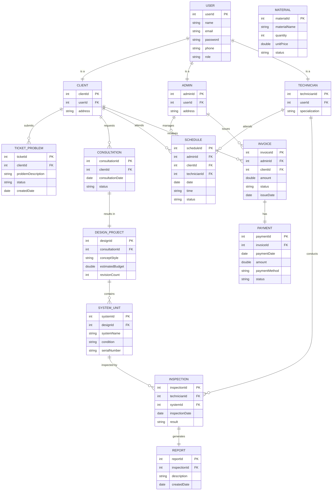
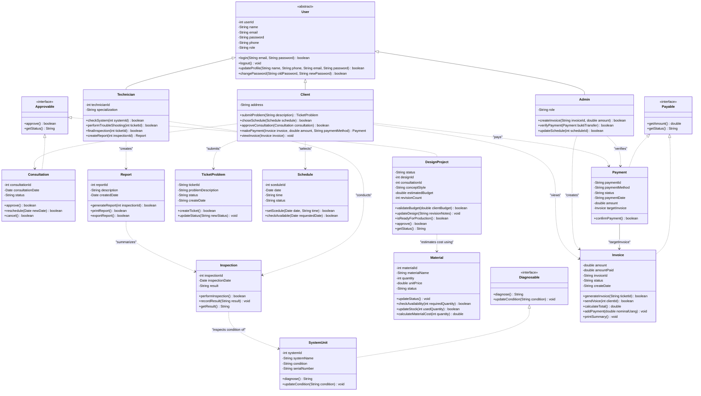

# Entity Relationship Diagram (ERD) & Struktur Arsitektur - KanggoLiving

Dokumen ini berisi pemodelan **Entity Relationship Diagram (ERD)** serta dokumentasi **Struktur Arsitektur Package & Interface** untuk sistem ERP skala mikro **KanggoLiving** berdasarkan implementasi OOP dan Class Diagram yang terbaru.

---

## 1. Diagram ERD (Mermaid)

Di bawah ini adalah representasi visual ERD menggunakan format **Mermaid.js**. Diagram ini menggambarkan entitas, atribut (termasuk Primary Key/Foreign Key), beserta hubungannya.



---

## 2. Kamus Data Entitas & Atribut

### A. Pengguna & Aktor (Inheritance / Table-per-Subclass)
1. **`USER`**
   * `userId` (Integer, PK): ID unik untuk setiap user.
   * `name` (Varchar): Nama pengguna.
   * `email` (Varchar): Email aktif untuk login.
   * `password` (Varchar): Hash password akun.
   * `phone` (Varchar): Nomor telepon aktif.
   * `role` (Varchar): Jenis role (Admin, Client, Technician).
2. **`CLIENT`**
   * `clientId` (Integer, PK): ID Klien.
   * `userId` (Integer, FK): Relasi ke tabel USER.
   * `address` (Text): Alamat tinggal Klien.
3. **`ADMIN`**
   * `adminId` (Integer, PK): ID Administrator.
   * `userId` (Integer, FK): Relasi ke tabel USER.
   * `address` (Text): Alamat kantor Admin.
4. **`TECHNICIAN`**
   * `technicianId` (Integer, PK): ID Teknisi.
   * `userId` (Integer, FK): Relasi ke tabel USER.
   * `specialization` (Varchar): Keahlian teknisi (misal: Listrik, Sipil, Finishing).

### B. Proyek & Operasional
5. **`TICKET_PROBLEM`**
   * `ticketId` (Integer, PK): ID tiket keluhan pelanggan.
   * `clientId` (Integer, FK): Pengirim tiket.
   * `problemDescription` (Text): Penjelasan masalah.
   * `status` (Varchar): Status penanganan tiket.
   * `createdDate` (Date): Tanggal tiket dibuat.
6. **`CONSULTATION`**
   * `consultationId` (Integer, PK): ID Sesi Konsultasi.
   * `clientId` (Integer, FK): Klien yang mengajukan konsultasi.
   * `consultationDate` (Date): Waktu konsultasi dilaksanakan.
   * `status` (Varchar): Status konsultasi (Approved, Rescheduled, Cancelled).
7. **`DESIGN_PROJECT`**
   * `designId` (Integer, PK): ID Proyek Desain.
   * `consultationId` (Integer, FK): Sesi konsultasi rujukan.
   * `conceptStyle` (Varchar): Gaya desain yang disepakati (misal: Minimalis, Japandi).
   * `estimatedBudget` (Double): Estimasi anggaran biaya (RAB).
   * `revisionCount` (Integer): Jumlah revisi desain yang sudah dilakukan.
8. **`SYSTEM_UNIT`**
   * `systemId` (Integer, PK): ID Unit Sistem dalam ruangan.
   * `designId` (Integer, FK): Proyek desain terkait.
   * `systemName` (Varchar): Nama unit sistem (misal: Instalasi AC, Kabinet Dapur).
   * `condition` (Varchar): Kondisi kelayakan.
   * `serialNumber` (Varchar): Nomor seri komponen.
9. **`MATERIAL`**
   * `materialId` (Integer, PK): ID Material.
   * `materialName` (Varchar): Nama bahan baku.
   * `quantity` (Integer): Jumlah stok.
   * `unitPrice` (Double): Harga satuan material.
   * `status` (Varchar): Status ketersediaan.

### C. Penjadwalan & Laporan
10. **`SCHEDULE`**
    * `scheduleId` (Integer, PK): ID Jadwal.
    * `adminId` (Integer, FK): Admin pengatur jadwal.
    * `clientId` (Integer, FK): Klien yang terlibat.
    * `technicianId` (Integer, FK): Teknisi yang ditugaskan.
    * `date` (Date): Tanggal jadwal.
    * `time` (Varchar): Waktu/jam pelaksanaan.
    * `status` (Varchar): Status jadwal (Pending, Completed).
11. **`INSPECTION`**
    * `inspectionId` (Integer, PK): ID Inspeksi lapangan.
    * `technicianId` (Integer, FK): Teknisi penanggung jawab.
    * `systemId` (Integer, FK): Unit sistem yang diperiksa.
    * `inspectionDate` (Date): Tanggal pemeriksaan dilakukan.
    * `result` (Text): Hasil/catatan temuan inspeksi.
12. **`REPORT`**
    * `reportId` (Integer, PK): ID Dokumen Laporan.
    * `inspectionId` (Integer, FK): Rujukan kegiatan inspeksi.
    * `description` (Text): Uraian laporan akhir.
    * `createdDate` (Date): Tanggal penerbitan laporan.

### D. Keuangan
13. **`INVOICE`**
    * `invoiceId` (Integer, PK): ID Invoice/Tagihan.
    * `adminId` (Integer, FK): Penerbit invoice.
    * `clientId` (Integer, FK): Penerima invoice.
    * `amount` (Double): Total nilai tagihan.
    * `status` (Varchar): Status pembayaran (Unpaid, Paid).
    * `issueDate` (Date): Tanggal invoice diterbitkan.
14. **`PAYMENT`**
    * `paymentId` (Integer, PK): ID Transaksi Pembayaran.
    * `invoiceId` (Integer, FK): Rujukan tagihan.
    * `paymentDate` (Date): Tanggal pembayaran dilakukan.
    * `amount` (Double): Nominal yang dibayarkan.
    * `paymentMethod` (Varchar): Metode pembayaran (misal: Transfer Bank, E-Wallet).
    * `status` (Varchar): Status verifikasi pembayaran.

---

## 3. Aturan Bisnis & Kardinalitas (Relationships)
1. **User Subclass (1:1)**: Setiap entitas `CLIENT`, `ADMIN`, dan `TECHNICIAN` harus terasosiasi tepat ke satu record `USER`.
2. **Klien & Tiket (1:N)**: Klien dapat mengirimkan banyak tiket pengaduan (`TICKET_PROBLEM`), namun satu tiket hanya dimiliki satu Klien.
3. **Konsultasi & Desain (1:1)**: Hasil dari satu sesi `CONSULTATION` yang disetujui akan menghasilkan tepat satu rancangan `DESIGN_PROJECT`.
4. **Desain & Unit Sistem (1:N)**: Satu proyek `DESIGN_PROJECT` terdiri atas satu atau beberapa `SYSTEM_UNIT` yang dipasang di ruangan.
5. **Penjadwalan Multilateral (1:N)**: Tabel `SCHEDULE` menjembatani koordinasi antara satu `ADMIN`, satu `CLIENT`, dan satu `TECHNICIAN`.
6. **Pemeriksaan & Laporan (1:1)**: Kegiatan `INSPECTION` akan menghasilkan tepat satu laporan resmi (`REPORT`).
7. **Invoice & Pembayaran (1:1)**: Satu `INVOICE` dibayar melalui satu transaksi `PAYMENT`.

---

## 4. Struktur Arsitektur & Package

Proyek **KanggoLiving** diorganisasikan ke dalam beberapa package terpisah untuk meningkatkan modularitas, kerapian, dan kemudahan pemeliharaan (*maintainability*):

```
src/kanggoliving_poryek/
│
├── Main.java (Titik masuk utama / Simulasi alur sistem)
│
├── users/ (Aktor/Pengguna Sistem)
│   ├── User.java (Parent class abstract)
│   ├── Admin.java
│   ├── Client.java
│   └── Technician.java
│
├── model/ (Objek Bisnis / Data Model)
│   ├── Consultation.java
│   ├── DesignProject.java
│   ├── Inspection.java
│   ├── Invoice.java
│   ├── Material.java
│   ├── Payment.java
│   ├── Report.java
│   ├── Schedule.java
│   ├── SystemUnit.java
│   └── TicketProblem.java
│
└── interfaces/ (Kontrak Abstraksi Metode OOP)
    ├── Approvable.java
    ├── Diagnosable.java
    └── Payable.java
```

---

## 5. Implementasi Class Interface

Untuk memenuhi prinsip abstraksi dan standarisasi perilaku dalam OOP, diimplementasikan 3 kelas Interface berikut:

### A. Interface `Approvable`
Digunakan untuk entitas yang memerlukan alur persetujuan (*approval*).
* **Package**: `kanggoliving_poryek.interfaces`
* **Metode**:
  * `boolean approve()`: Menyetujui entitas/dokumen.
  * `String getStatus()`: Mendapatkan status persetujuan saat ini.
* **Kelas Penerap (`implements`)**:
  * `Consultation`: Sesi konsultasi yang disetujui klien.
  * `DesignProject`: Draf proyek desain yang disetujui klien untuk siap diproduksi.

### B. Interface `Payable`
Digunakan untuk entitas yang memproses nilai nominal transaksi keuangan.
* **Package**: `kanggoliving_poryek.interfaces`
* **Metode**:
  * `double getAmount()`: Mendapatkan jumlah nominal uang tagihan/pembayaran.
  * `String getStatus()`: Mendapatkan status pembayaran.
* **Kelas Penerap (`implements`)**:
  * `Invoice`: Tagihan proyek.
  * `Payment`: Transaksi pembayaran masuk.

### C. Interface `Diagnosable`
Digunakan untuk komponen fisik yang dapat diinspeksi atau didiagnosa kondisinya.
* **Package**: `kanggoliving_poryek.interfaces`
* **Metode**:
  * `String diagnose()`: Mendiagnosa kondisi fisik komponen.
  * `void updateCondition(String condition)`: Mengubah kondisi kelayakan komponen.
* **Kelas Penerap (`implements`)**:
  * `SystemUnit`: Unit sistem di dalam ruangan klien (misal instalasi kelistrikan).

---

## 6. Diagram Kelas (Class Diagram - Mermaid)

Berikut adalah diagram kelas lengkap yang menunjukkan seluruh atribut, metode, relasi pewarisan (*inheritance*), implementasi *interface*, asosiasi (*association*), serta ketergantungan (*dependency*) antarkelas, termasuk relasi konseptual untuk kelas `Material` dan `Inspection`:



